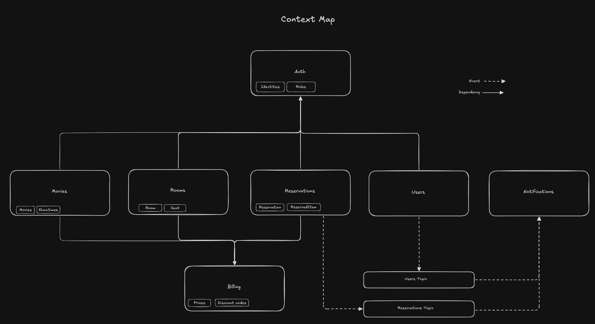

# NestJS Cinema Reservation API

A personal project designed to explore and refine software architecture principles using modern TypeScript tools and best practices. This project leverages NestJS to structure a modular, scalable backend application, with PostgreSQL and Drizzle for database operations, and Redis for caching and ephemeral data.

#### Tech Stack

- TypeScript
- NestJS
- Drizzle-ORM
- PostgreSQL
- Redis

## Context Map

This context map illustrates the modular context boundaries and their dependencies. Key modules include:

- `Auth`: Handles authorization and authentication via JWT
- `Users` [TBD]: Core user profiles, emits events for notifications
- `Reservations` [TBD]: Central to the business domain; links users, showtimes, and billing
- `Movies`: Handles movie metadata and showtimes
- `Rooms`: Manages cinema rooms and seating
- `Billing`: Manages prices and discount codes
- `Notifications` [TBD]: Listens to pub/sub events from users and reservations

### How to run locally

0. Use correct version of Node.js (see `.nvmrc`).
1. Prepare `.env` file (see `.env.dist`).
2. Install dependencies with `yarn`.
3. Start database and redis with `docker-compose up -d`.
4. Run the application with `yarn start:dev`
